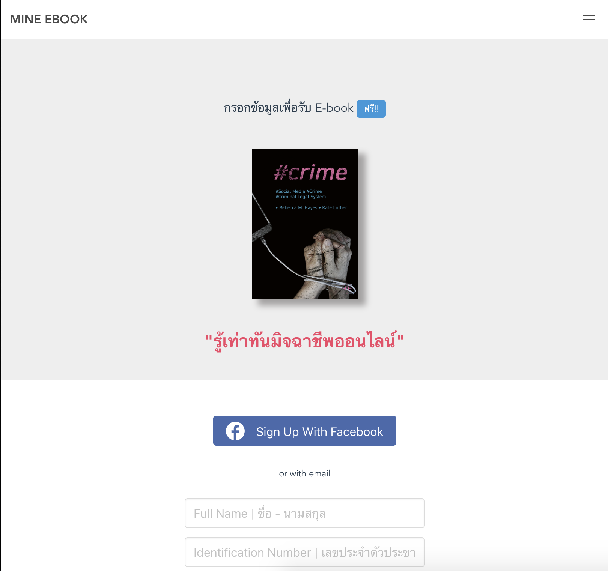
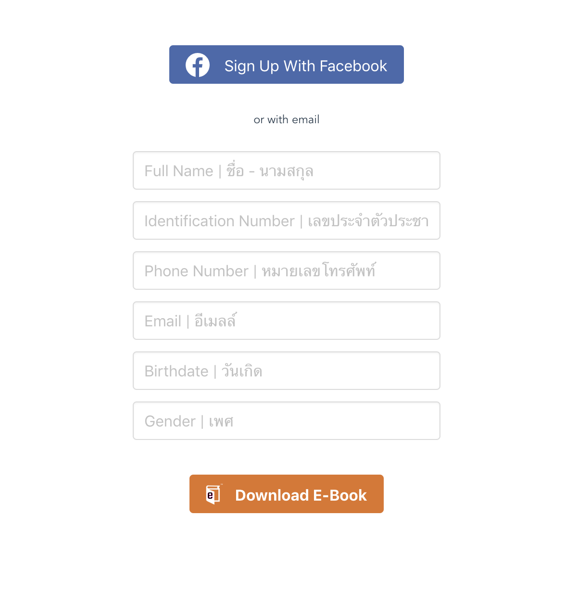

# Phishing

อ๊ะ! รู้ตัวหรือเปล่า
ว่าเกือบตกเป็นเหยื่อของ PHISHING แล้วนะ

หาคำตอบเกี่ยวกับ PHISHING ให้มากขึ้น
เลื่อนลงข้างล่างเลย

### ฟิชชิ่งคืออะไร – ใช่การตกปลาหรือเปล่า?

Phishing (ฟิชชิ่ง) เป็นรูปแบบหนึ่งของเทคนิคการหลอกลวงโดยใช้จิตวิทยาผ่านระบบคอมพิวเตอร์ มักมาในรูปของอีเมลหรือเว็บไซต์ เพื่อหลอกให้เหยื่อเผยข้อมูลความลับต่าง ๆ เช่น รหัสผ่านหรือหมายเลขบัตรเครดิต เป็นต้น รวมไปถึงหลอกล่อให้เหยื่อกดลิงค์เพื่อแอบติดตั้งมัลแวร์ลงบนคอมพิวเตอร์โดยที่เหยื่อไม่รู้ตัวอีกด้วย

อีเมล Phishing ส่วนใหญ่มักมาในรูปของประกาศแจ้งจากทางธนาคาร หรือจากเว็บ Social Media เช่น Facebook หรือ Twitter เป็นต้น โดยเนื้อหาส่วนใหญ่จะระบุประมาณว่า ชื่อบัญชีของท่านมีปัญหาหรือหมดอายุ จำเป็นต้องอัพเดทชื่อบัญชีใหม่ ให้กดลิงค์ตามที่แนบมาเพื่อกรอกข้อมูลซึ่งลิงค์ดังกล่าวไม่ได้เชื่อมโยงไปยังหน้าเว็บไซต์ทาง การของธนาคารหรือ Social Media แต่อย่างใด แต่จะเป็นเว็บไซต์ที่แฮ็คเกอร์ปลอมขึ้นมาเพื่อให้คล้ายคลึงกับเว็บไซต์ต้นฉบับ ผู้ใช้ที่ไม่สังเกตถึงความผิดปกติดังกล่าวและเผลอกรอกข้อมูลส่วนตัวลงไป ข้อมูลเหล่านั้นก็จะตกสู่มือของแฮ็คเกอร์โดยทันที

### แล้วฟิชชิ่งมีกี่ประเภทกันล่ะ?

#### ฟิชชิ่งที่ใช้เพื่อขโมยรหัสผ่าน (การเก็บรวบรวมข้อมูลรับรอง)

ผู้โจมตีโดยใช้ฟิชชิ่งสามารถล่อหลอกเพื่อให้คุณเปิดเผยรหัสผ่านโดยส่งลิงก์ล่อลวงให้คุณ ที่อยู่เว็บที่ส่งมาในข้อความอาจดูเหมือนเว็บไซต์หนึ่ง แต่จริง ๆ แล้วเป็นอีกเว็บไซต์หนึ่ง คุณสามารถดูที่อยู่จริง ๆ ของ URL ได้ในคอมพิวเตอร์โดยเลื่อนเมาส์ไปบนลิงก์ แต่ลิงก์สามารถล่อหลอกให้หลงเชื่อโดยมีตัวอักษรที่คล้ายกับเว็บไซต์จริง หรือโดยการใช้ชื่อโดเมนที่หนึ่งตัวอักษรจากชื่อโดเมนจริงขาดหายไป และอาจดูเหมือนจะนำคุณเข้าเว็บเพจของบริการที่คุณใช้งานอยู่ อย่างเช่น Gmail หรือ Dropbox หน้าจอเข้าสู่ระบบของปลอมลอกเลียนแบบเหล่านี้มักจะดูเหมือนของจริง และล่อหลอกให้คุณหลงเชื่อเพื่อพิมพ์ชื่อผู้ใช้และรหัสผ่าน หากคุณพิมพ์ชื่อผู้ใช้และรหัสผ่านลงไป ผู้โจมตีจะได้รับข้อมูลล็อกอินของคุณ
ดังนั้น ก่อนพิมพ์รหัสผ่าน ให้ดูที่แถบที่อยู่ของเว็บเบราว์เซอร์ แถบที่อยู่ดังกล่าวจะแสดงชื่อโดเมนจริงของเว็บไซต์ หากชื่อโดเมนไม่ตรงกับเว็บไซต์จริงที่คุณต้องการล็อกอิน อย่าดำเนินการต่อ! อย่าลืมว่าการมีโลโก้ของบริษัทอยู่ในเว็บไม่ได้เป็นการยืนยันว่าเว็บดังกล่าวเป็นของจริง ทุกคนสามารถคัดลอกโลโก้หรือการออกแบบต่าง ๆ แล้วนำไปใส่ไว้ในเว็บไซต์ของตนเพื่อล่อหลอกให้คุณหลงเชื่อได้

> ผู้โจมตีด้วยฟิชชิ่งบางรายจะใช้เว็บไซต์ที่ดูเหมือนที่อยู่เว็บที่เป็นที่นิยมเพื่อหลอกให้คุณหลงเชื่อ เช่น https://wwwpaypal.com/ ไม่ใช่เว็บไซต์เดียวกับ https://www.paypal.com/ ในทำนองเดียวกัน https://www.paypaI.com/ (โดยใช้ “i” ตัวพิมพ์ใหญ่แทนตัวอักษร “L” พิมพ์เล็ก) ไม่ใช่เว็บไซต์เดียวกับ https://www.paypal.com/ มีการใช้โปรแกรมย่อ URL เพื่อทำให้ URL ที่ยาวอ่านง่ายขึ้นหรือพิมพ์ได้ง่ายขึ้น แต่โปรแกรมดังกล่าวสามารถนำมาใช้เพื่อซ่อนแหล่งที่มาของเว็บไซต์อันตราย หากคุณได้รับ URL แบบย่อ อย่างเช่นลิงก์ t.co จาก Twitter ให้ลองพิมพ์ที่อยู่ดังกล่าวลงใน https://www.checkshorturl.com/ เพื่อดูว่าเว็บไซต์ที่คุณจะเข้าจริง ๆ คือเว็บใดโปรดทราบว่า การสร้างอีเมลเพื่อให้แสดงที่อยู่ส่งกลับที่ผิดทำได้ไม่ยาก ในที่นี้หมายความว่า การตรวจสอบที่อยู่อีเมลของผู้ส่งเพียงอย่างเดียวไม่เพียงพอที่จะยืนยันว่าอีเมลดังกล่าวส่งมาโดยบุคคลตามที่อยู่อีเมลที่ปรากฏอย่างแท้จริง`

#### สเปียร์ฟิชชิ่ง

การโจมตีด้วยฟิชชิ่งส่วนใหญ่เป็นการโจมที่เกิดขึ้นเป็นวงกว้าง ผู้โจมตีอาจส่งอีเมลถึงผู้คนจำนวนหลายร้อยหลายพันคน โดยอ้างว่ามีวิดีโอน่าตื่นเต้นให้ดู มีไฟล์เอกสารสำคัญ มีข้อขัดแย้งเกี่ยวกับการเรียกเก็บเกิดขึ้น
แต่บางครั้งเป้าหมายการโจมตีด้วยฟิชชิ่งจะขึ้นอยู่กับข้อมูลบางอย่างที่ผู้โจมตีทราบเกี่ยวกับบุคคลใดบุคคลหนึ่งอยู่แล้ว วิธีการนี้เรียกว่า “สเปียร์ฟิชชิ่ง” ลองจินตนาการว่า คุณได้รับอีเมลจากลุงบอริส ที่ระบุว่ามีภาพลูก ๆ ของคุณลุงแนบมาด้วย ทั้งนี้เนื่องจาก บอริสมีลูกและดูเหมือนอีเมลจะส่งมาจากที่อยู่อีเมลของคุณลุงจริง ๆ คุณเลยเปิดอ่านอีเมล เมื่อเปิดอีเมล มีไฟล์เอกสาร PDF แนบมากับอีเมลด้วย เมื่อเปิดไฟล์ PDF อาจมีแม้กระทั่งรูปถ่ายลูก ๆ ของบอริส แต่ไฟล์จะติดตั้งมัลแวร์ในอุปกรณ์โดยที่คุณไม่รู้ตัว โดยมัลแวร์ดังกล่าวจะใช้เพื่อสอดแนมเกี่ยวกับคุณ คุณลุงบอริสไม่ได้ส่งอีเมลดังกล่าว แต่ใครบางคนที่รู้ว่าลุงของคุณชื่อบอริส (และรู้ว่าคุณลุงบอริสมีลูก) เป็นคนส่งอีเมลดังกล่าว ไฟล์ PDF ที่คุณคลิกเปิดได้เปิดใช้โปรแกรม PDF แต่ยังฉวยโอกาสจากข้อผิดพลาดที่มีอยู่ในซอฟต์แวร์เพื่อใช้รหัสของตัวเอง นอกจากจะแสดงไฟล์ PDF แล้ว ไฟล์ดังกล่าวยังดาวน์โหลดมัลแวร์ไว้ในคอมพิวเตอร์ของคุณด้วย มัลแวร์ดังกล่าวสามารถเรียกดูข้อมูลติดต่อและบันทึกสิ่งที่กล้องและไมโครโฟนในอุปกรณ์ของคุณเห็นหรือได้ยินด้วย
วิธีที่ดีที่สุดในการปกป้องตัวคุณเองจากการโจมตีโดยใช้ฟิชชิ่งคือ อย่าคลิกที่ลิงก์หรือเปิดเอกสารใดก็ตามที่แนบมาด้วยโดยเด็ดขาด แต่สำหรับบางคน คำแนะนำนี้อาจฟังดูแล้วไม่สมเหตุผลในทางปฏิบัติ ด้านล่างเป็นบางส่วนของวิธีการป้องกันการโจมตีโดยใช้ฟิชชิ่งที่นำไปใช้ได้จริง

### แล้วฟิชชิ่งที่ว่า หน้าตามันเป็นยังไง?

หากเป็น Phishing ในรูปแบบของอีเมล สามารถตรวจสอบได้โดย

1. ตรวจสอบอีเมลผู้ส่ง

สิ่งที่ต้องสังเกตเป็นอันดับแรกคือ ชื่อและอีเมลของผู้ส่ง โดยอีเมลปลอมมักจะใช้ชื่อที่เป็นทางการ เช่น Apple ID, Apple Music เพื่อหลอกผู้ใช้ว่าส่งจาก Apple ดังนั้นแล้วสิ่งที่เราต้องตั้งใจดู คือ อีเมลแอดเดรส ที่ส่งมาถึงเรา จากรูปตัวอย่าง no-replysnotificationaccountlogins@newsletter-01vannenza-01.apple.com ดูแล้วรู้เลยว่าเป็นอีเมลปลอม เนื่องจากอีเมลของ Apple จะไม่ใช้อีเมลโดเมนอื่นที่ดูไม่เป็นทางการ และอีเมลที่ใช้ติดต่อของ Apple คือ คือ AppleSupport@InsideApple.apple.com

2. เนื้อหามีการร้องขอแปลกๆ

บางอีเมลปลอมมักจะหลอกลวงให้เราเปิดไฟล์ PDF เช่น ใบเสร็จรับเงิน ใบกำกับภาษี หรือเอกสารต่างๆ ที่ดูว่ามาจาก Apple จริงๆ โดยใส่โลโก้ และจัดวางข้อความให้เหมือน ดังตัวอย่าง เป็นอีเมลหลอกว่าเราได้มีการสั่งซื้อ iPhone 7 Plus และมีข้อความระบุในอีเมลว่า “เราแนะนำให้คุณเปิดไฟล์แนบ (PDF) เพื่อตรวจสอบสถานะการจัดส่ง คุณสามารถยกเลิกการสั่งซื้อได้ภายใน 24 ชั่วโมง” ซึ่งการร้องขอลักษณะนี้ดูแปลกและไม่น่าเชื่อถือ หากเราไม่ได้มีการสั่งซื้อ ก็ควรจะหลีกเลี่ยงหรือโทรสอบถามกับทาง Apple จะดีกว่า

3. ตรวจสอบชื่อผู้รับ

ชื่อผู้รับอีเมลควรจะเป็นชื่อและอีเมลของเราจริงๆ ดังตัวอย่าง ได้ส่งถึง “undisclosed recipients” ซึ่งระบุว่าเป็นกลุ่มผู้รับที่ไม่รู้จัก และการจั่วหัวข้อเริ่มแรก Dear Apple User ซึ่งการระบุผู้รับทั้ง 2 แบบนี้ คาดการณ์ได้ว่าเป็นอีเมลปลอมแน่นอน เพราะอีเมลจาก Apple จะต้องระบุชื่อและอีเมลของผู้รับชัดเจน โดยต้องแสดงเป็นชื่อของเราจริงๆ เช่น Dear Sakura Phutthalong

4. ตรวจสอบคำขึ้นต้นทักทาย

เคสนี้จะคล้ายๆ กับการตรวจสอบชื่อผู้รับ ซึ่งคำขึ้นต้นทักทายในอีเมล ก็ควรจะเป็นคำทักทายที่เป็นชื่อของเราจริงๆ อย่างแอป Paypal ที่เป็นแอปทางด้านการเงินที่น่าเชื่อถือและได้รับความไว้วางใจจากผู้ใช้ทั่วโลก ก็ยังคงมีอีเมลปลอมส่งมาหลอกผู้ใช้หลายคนอยู่ ดังนั้นควรคำนึงอยู่เสมอว่า ผู้ให้บริการจะไม่ใช้คำขึ้นต้นทักทายที่ไม่ใช่ชื่อเราเป็นอันขาด ดังรูปตัวอย่าง Dear Valued User การขึ้นต้นคำทักทายลักษณะนี้ เราต้องสังเกตและควรหลีกเลี่ยงที่จะกดลิงค์และกรอกข้อมูลสำคัญของเราลงไป

5. ดูการจัดรูปแบบอีเมล

ในรูปตัวอย่างนี้เป็นอีเมลจาก Paypal ที่นอกจากชื่อผู้ส่งและหัวข้ออีเมลจะดูแปลกปลอมแล้ว การจัดวางรูปแบบอีเมล ยังผิดแปลกไปจากอีเมลจริงของ Paypal อีกด้วย หากเราเคยใช้ Paypal จะรู้เลยว่ารูปแบบอีเมลของ Paypal จะไม่ใช่ลักษณะแบบนี้ ดังนั้นไม่ว่าจะเป็นอีเมลจากผู้ให้บริการเจ้าไหนก็ตาม หากเราดูรูปแบบแล้วรู้สึกว่าไม่เหมือนหรือคล้ายกับของเดิม ก็ไม่ควรที่จะกดลิงค์หรือให้ข้อมูลใดๆ ทั้งสิ้น

ทั้งหมดนี้ก็เป็นตัวอย่างอีเมลปลอมและเทคนิคการตรวจสอบ เพื่อให้เราสังเกตก่อนที่จะกดหรือกรอกข้อมูลบัตรเครดิตลงไป สำหรับใครที่ได้รับอีเมลจากผู้ให้บริการต่างๆ ไม่ว่าจะเป็น Apple, Paypal, Ebay, Amazon หรือ Youtube ก็ควรจะเช็คและดูให้ดีๆ ก่อน หากไม่แน่ใจแนะนำให้ส่งอีเมล์หรือโทรสอบถามกับฝ่ายสนับสนุนก่อนจะดีกว่า

### เล่นเน็ตยังไง ไม่ให้ตกเป็นเหยื่อของฟิชชิ่ง?

1. ตรวจสอบการสะกดของคำ ทั้งเนื้อหาของเว็บไซต์ ชื่อโดเมนของเว็บไซต์ และชื่อผู้ส่งอีเมล ตัวอย่างชื่อเว็บไซต์/อีเมลที่น่าสงสัย เช่น อีเมลที่แอบอ้างว่าเป็นสถาบันการเงิน ชื่อเว็บไซต์ที่เลียนแบบธนาคารเป็นต้น
2. ตรวจสอบ url เสมอ ไม่ควรคลิก link ที่น่าสงสัย
3. ตรวจสอบการตั้งค่าความปลอดภัยอย่างสม่ำเสมอและตรวจสอบรายการทำธุรกรรมเสมอ เช่น เปลี่ยนรหัสผ่านที่ใช้เป็นประจำหรือตรวจสอบรายการเดินบัญชีเป็นระยะ
4. คิดให้ถี่ถ้วนก่อนกรอกข้อมูลส่วนตัว โดยเฉพาะข้อมูลสำหรับการทำธุรกรรมทางการเงิน
5. เฝ้าระวังเนื้อหาอีเมลหรือเว็บไซต์ที่เกินจริง เช่น จะระงับการใช้งานของคุณและเรียกขอข้อมูลส่วนตัว โดยเฉพาะข้อมูลสำหรับทำธุรกรรม
6. ไม่เปิดไฟล์แนบหรือดาวน์โหลดไฟล์จากเว็บไซต์/อีเมลที่ไม่น่าเชื่อถือ เช่น ไฟล์ .zip .doc .xls
7. ไม่ส่งต่ออีเมลที่น่าสงสัยหรือไม่ทราบแหล่งที่มา
   ทั้งนี้ฟิชชิ่งสามารถเป็นได้ทั้งรูปแบบของเว็บไซต์และอีเมลซึ่งได้รับความนิยมมาก นอกจากนี้ Phishing อาจมาในรูปแบบของข้อความ SMS, เบอร์โทรศัพท์แอบอ้างเป็นเจ้าหน้าที่พนักงาน หรือ Mobile Application
